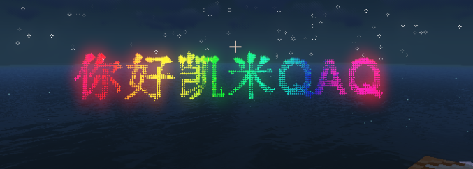

<div align="center">


# MiauParticleEffects - Cat Particle Effects

### A little cat turns redstone music into a sky full of light.
### Bind note blocks to particle effects for a visual feast alongside your redstone music.

[](#requirements)
[](#requirements)
[](#requirements)
[](#license)

</div>

---

## About

**MiauParticleEffects** is a Minecraft Java Fabric mod made for **redstone music**. It binds note blocks to particle effects so every activated note can become part of a synchronized visual performance:

- Render lyrics as particle pixels with rich entrance and exit animations.
- Cast particle effects including hollow cubes, tetrahedrons, cosmic explosions, and water ripples.
- Make a bouncing comet travel between activated note blocks.
- Use solid colors, static gradients, flowing rainbow gradients, or continuously cycling rainbow colors.

Particle-written lyrics + a visualizer following your redstone melody creates a single experience where **music and light become one**.

---

## Requirements

| Item | Version |
|---|---|
| Minecraft | **1.21.11** |
| Loader | Fabric Loader **>= 0.16.0** |
| API | Fabric API for 1.21.11 |
| Java | **21** |

> Install the mod on both client and server. A dedicated server needs the mod to detect note blocks and broadcast display events.

## Installation

1. Install [Fabric Loader](https://fabricmc.net/use/) for Minecraft 1.21.11.
2. Put `MiauParticleEffects-1.0.jar` in your `mods/` folder.
3. Install the latest compatible [Fabric API](https://modrinth.com/mod/fabric-api).
4. Launch the game and run `/mpe` or `/miauparticleeffects`.

---

## Features

### Particle Lyrics

```text
/mpe text "<lyrics>" <x> <y> <z> [options]
```

- Rasterizes every character into particle pixels.
- Supports Minecraft `§` color codes.
- Supports `slide`, `scale`, `spacing`, `clarity`, and fade animations.
- Uses global `density` to control pixel spacing, quality, and particle cost.

### Particle Effects

```text
/mpe effect <cube|tetra|explosion|wave> <x> <y> <z> [options]
```

- **cube** — hollow wireframe cube
- **tetra** — hollow tetrahedron
- **explosion** — cosmic particles radiating in every direction
- **wave** — expanding water ripple with controllable speed

### Note-Block Comet

```text
/mpe noteblock on [options]
```

When a note block inside the detection radius is activated, a **bouncing comet with a fading trail** jumps to the top-center of that block. Multiple note blocks activated in the same tick are distributed across the available balls; a single target can be shared when there are more balls than targets.

### Four Color Modes

```text
color=#FFD700
gradient=#FF0000,#00FF00,#0000FF
gradient=rainbow
color=rainbow
```

- `color=#...` — solid color
- `gradient=#...,#...` — static gradient
- `gradient=rainbow` — flowing rainbow gradient
- `color=rainbow` — one color cycling through the rainbow

---

## Command Reference

| Command | Description |
|---|---|
| `help [subcommand]` | Show general or subcommand-specific help |
| `density <0.01~1>` | Set persistent pixel sampling density |
| `text "<text>" <x> <y> <z> [options]` | Display text with particles |
| `effect <type> <x> <y> <z> [options]` | Cast a particle effect |
| `noteblock on\|off\|status\|set` | Enable and manage the note-block comet |
| `clear [all\|text\|effect\|id=<ID>]` | Clear displays |
| `autoclear <on\|off>` | Let old text exit before new text starts |

Run a subcommand without its arguments for detailed usage:

```text
/mpe text
/mpe effect
/mpe noteblock
```

Or query it directly:

```text
/mpe help text
/mpe help effect
/mpe help noteblock
```

### Common Options

```text
scale=1.5 color=#FFD700 towards=45,0,0 duration=100 enter=10 exit=10
delay=0 curve=ease-out in=slide:up,scale:enlarge out=clarity:blur fade=both
move=0,2,0,20,linear id=my-lyric
gradient=#FF0000,#00FF00 gradient=rainbow color=rainbow force=true
```

`force=true` bypasses normal particle distance culling. It is useful for distant displays, but can increase client rendering cost.

### Note-Block Options

```text
selector=@p radius=16 trail=24 curve=arc|sine|line count=1 height=3 force=true
```

---

## Examples

```text
/mpe text "§4Burn §6bright §btonight" 100 64 100 scale=1.2 color=#FFD700 in=slide:up,scale:enlarge fade=in
/mpe text "Gradient lyrics" 100 64 100 gradient=#FF0000,#00FF00 move=0,2,0,40,linear
/mpe effect cube 100 64 100 size=2 color=#00FFFF rotate=0,1,0,3
/mpe effect explosion 100 64 100 size=6 gradient=#FF4500,#FFFFFF
/mpe effect wave 100 64 100 size=5 speed=3 color=#00FF00
/mpe noteblock on radius=32 trail=24 count=2 height=3
```

---

## Configuration

The mod creates `config/miauparticleeffects.json` on first launch:

```json
{
  "density": 0.1,
  "autoclear": false,
  "defaultScale": 1.0
}
```

- `density` controls text sampling density.
- `autoclear` makes new text wait for old text to exit.
- `defaultScale` controls the default glyph height.

---

## Screenshots

<table>
  <tr>
    <td></td>
    <td></td>
    <td></td>
  </tr>
</table>

More details can be seen in the [showcase video on Bilibili](https://www.bilibili.com/video/BV12Ket6rEG9/).

---

## Documentation

- [English usage guide](docs/USAGE.md)
- [中文使用教程](docs/USAGE_CN.md)
- [中文 README](README_CN.md)

---

## Roadmap

- [x] Particle text and animations
- [x] Cube, tetrahedron, explosion, and wave effects
- [x] Note-block comet binding
- [x] Static gradients and rainbow color modes
- [ ] Integration with the [NoteBlockWeb editor](https://github.com/omninbs/NoteBlockWeb)
- [ ] More languages and particle effects
- [ ] Automatic redstone music detection and effect generation
- [ ] More note-block visualizers such as beat bars and equalizers

---

## Contributing

Issues, suggestions, and pull requests are welcome. Please include:

- Minecraft, Fabric Loader, and Fabric API versions
- The exact command used
- A log or crash report when relevant
- A short video or screenshot for rendering issues

Most of the implementation was developed with AI assistance, followed by manual integration and build verification. Contributions and corrections are welcome.

---

## License

All Rights Reserved. This project is currently closed-source. Contact the author before redistributing or reusing the code.

## Credits

Built with [Fabric](https://fabricmc.net/) and the Fabric API. Inspired by the creativity of redstone music.
